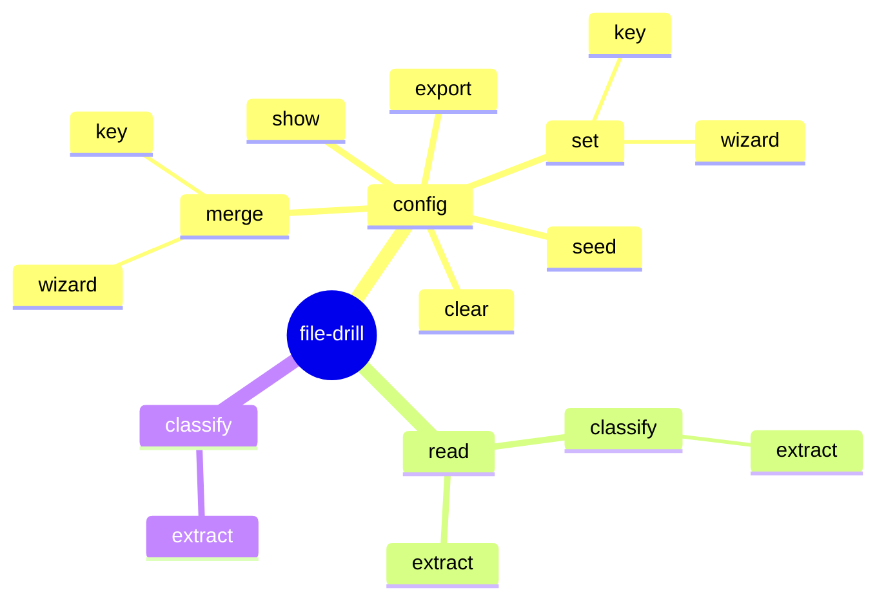

# file-drill

[](https://www.nuget.org/packages/file-drill)
[](https://www.nuget.org/packages/file-drill)
[](https://github.com/danielklecha/SharpIppNext/blob/master/LICENSE.txt)

**file-drill** is a powerful tool designed for processing file content using both local code and AI-based services.

## Features

- Read file content efficiently
- Classify content using AI
- Extract specific fields using AI

## Installation

Install the tool using the command:

```powershell
dotnet tool install --global file-drill
```

## Getting started

1. Configure AI Service Provider - Obtain an API key from an AI provider (e.g., Google Gemini) and set it up.

    ```powershell
    file-drill config set key AIServices:Gemini '{ "Type": "Gemini", "Key": "<secret>", "ModelName": "<model-name>" }'
    file-drill config set key FallbackAIService '"Gemini"'
    ```

2. Configure schemas - for quick setup, seed sample configurations.

    ```powershell
    file-drill config seed
    ```

3. Verify configuration

    ```powershell
    file-drill config show
    ```

4. Extract data from file.

    ```powershell
    file-drill read classify extract c:\invoice.pdf
    ```

## Diagram of commands



## Configuration

```json
{
  "FallbackAIService": "<ai-service-name>",
  "ContentReader": {
    "AIService": "<ai-service-name>"
  },
  "ContentClassifier": {
    "AIService": "<ai-service-name>"
  },
  "FieldExtractor": {
    "AIService": "<ai-service-name>"
  },
  "AIServices": {
    "<ai-service-name>": {
      "Type": "<Ollama|OpenAI|Azure|Gemini>",
      "Url": "<endpoint-url>",
      "Key": "<secret>",
      "ModelName": "<model-name>"
    }
  },
  "Schemas": {
    "<schema-name>": {
      "Description": "<schema-description>",
      "Fields": {
        "field-name": {
          "Description": "<field-description>",
          "Type": "<String|DateTime|Bool|Int16|UInt16|Int32|UInt32|Int64|UInt64|Float|Double|Decimal>"
          "Enums": [ "optional", "array" , "with", "expected", "values" ]
        }
      }
    }
  }
}
```

## Supported file extensions

| Extensions | Library |
|---|---|
| `.txt`, `.md` | built-in |
| `.pdf` | PdfPig |
| `.docx`, `.dotx`, `.docm`, `.dotm` | DocumentFormat.OpenXml |
| `.png`, `.jpeg` | OCR using AI service |
| `.rtf` | RtfPipe |
| `.eml`, `.msg` | MsgReader |

## Supported AI services

| Service type | Library | Sample configuration |
|---|---|---|
| Ollama | Microsoft.Extensions.AI.Ollama | `{ "Type": "Ollama", "Url": "http://localhost:11434", "ModelName": "<model-name>" }` |
| Azure | Microsoft.Extensions.AI.AzureAIInference | `{ "Type": "Azure", "Url": "<endpoint-url>", "ModelName": "<deployment-name>", "Key": "<secret>" }` |
| OpenAI | Microsoft.Extensions.AI.OpenAI | `{ "Type": "OpenAI", "Url": "<endpoint-url>", "ModelName": "<model-name>", "Key": "<secret>" }` |
| Gemini | Mscc.GenerativeAI.Microsoft | `{ "Type": "Gemini", "Key": "<secret>", "ModelName": "<model-name>" }` |

## License

file-drill is provided as-is under the MIT license.
