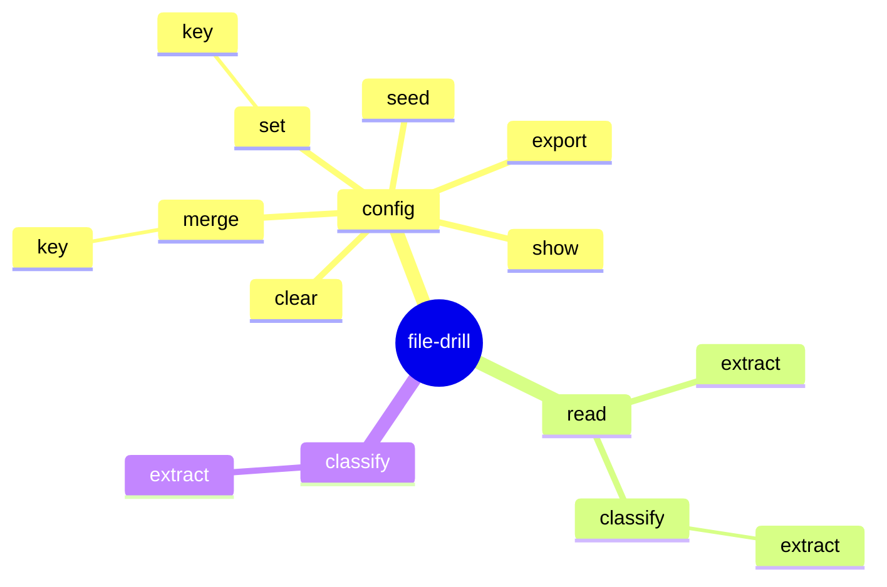

# file-drill

**file-drill** is a powerful tool designed for processing file content using both local code and AI-based services. It enables users to:

- Read file content efficiently
- Classify content using AI
- Extract specific fields using AI

## Getting started

1. Install the tool using command: `dotnet tool install --global file-drill`
2. Obtain API key from provider (e.g. Google Gemini)
3. Add provider Gemini (update secret and model name): `file-drill config set key AIServices:Gemini '{ "Type": "Gemini", "Key": "<secret>", "ModelName": "<model-name>" }'`
4. Set default provider `file-drill config set key FallbackAIService '"Gemini"'`
5. Configure schemas - for simplification load samples: `file-drill config seed`
6. Check complete configuration: `file-drill config show`
7. Extract data from file: `file-drill read classify extract c:\invoice.pdf`

## Diagram of commands

## Supported file extensions

| Extensions | Library |
|---|---|
| txt, md | built-in |
| pdf | PdfPig |
| docx, dotx, docm, dotm | DocumentFormat.OpenXml |
| png, jpeg | OCR using AI service |
| rtf | RtfPipe |
| eml, msg | MsgReader |

## Supported AI services

| Service | Library | Sample configuration |
|---|---|---|
| Ollama | Microsoft.Extensions.AI.Ollama | `{ "Type": "Ollama", "Url": "http://localhost:11434", "ModelName": "<model-name>" }` |
| Azure | Microsoft.Extensions.AI.AzureAIInference | `{ "Type": "Azure", "Url": "<endpoint-url>", "ModelName": "<deployment-name>", "Key": "<secret>" }` |
| OpenAI | Microsoft.Extensions.AI.OpenAI | `{ "Type": "OpenAI", "Url": "<endpoint-url>", "ModelName": "<model-name>", "Key": "<secret>" }` |
| Google | Mscc.GenerativeAI.Microsoft | `{ "Type": "Gemini", "Key": "<secret>", "ModelName": "<model-name>" }` |
